# AttrViz

**See any attribute, on the geometry it belongs to.** Right-click an object,
pick an attribute, and it draws in the viewport — in Solid shading, without
touching your mesh, your materials, or your render.

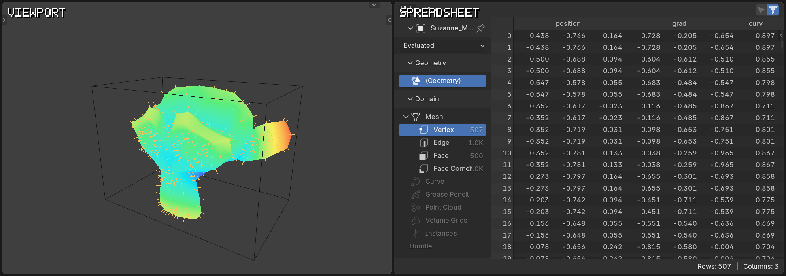

*The Spreadsheet's columns, and the same values drawn on the object.*

---

## The gap

Blender will show you **shape** — the viewport. And it will show you
**values** — the Spreadsheet editor, hundreds of rows of floats. It will not
show you the two together.

So you cross-reference. Read a row, find the element, hold the mapping in your
head, repeat.

If you work in Geometry Nodes, the **Viewer node** doesn't close this either.
It shows what the geometry *is* at that point in the tree — at best one
anonymous field on the active object, while you're inside the node editor. It
won't tell you what `plate_id` is on *that* face, in the viewport, beside the
object it belongs to.

AttrViz is that translation. It draws the values onto the geometry.

---

## Sixty seconds

Install (see [Install](#install)), then open the sidebar in the 3D viewport
(`N`) and pick the **Viz** tab.

1. Right-click any object → **AttrViz → Visualize Attribute**
2. Choose a domain
3. Choose an attribute

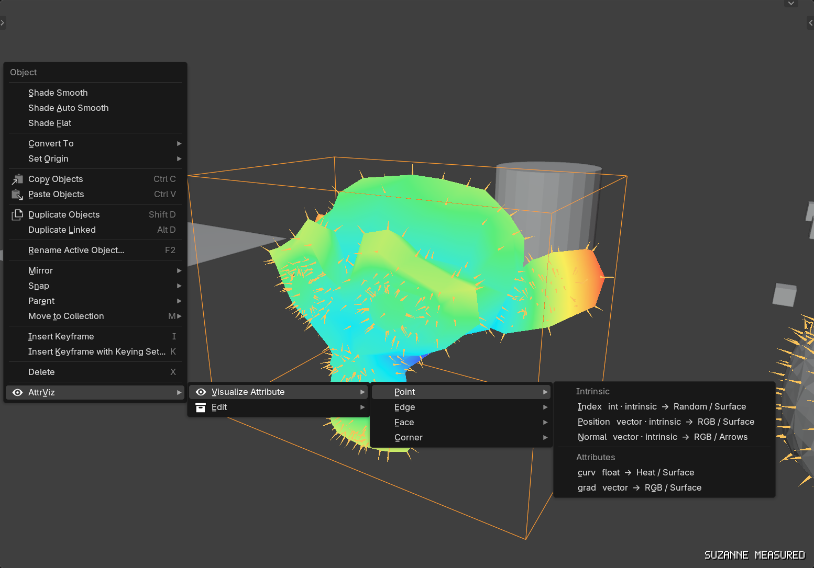

*`RMB → AttrViz → Visualize Attribute → Point → curv`. The row says what it
will make: `curv  float  →  Heat / Surface`.*

That's the whole loop. One click later:

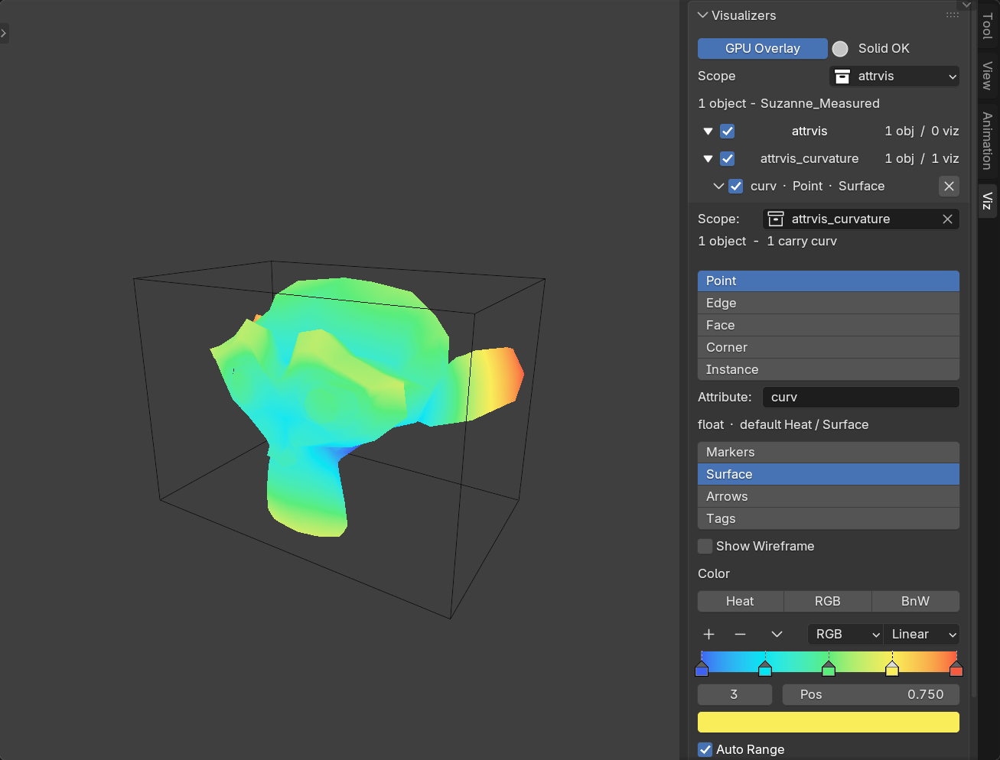

*The surface is drawn, and the new visualizer is listed in the Viz tab — Point,
`curv`, Surface, exactly what the menu said.*

The menu reads the object **after its modifiers have run**, so an attribute
your node tree just created is in the list, by name, beside the ones you
authored by hand. If you named it `grad`, you'll see `grad`.

**If it isn't there, you just found your bug.**

---

## What you're looking at

### Where attributes come from

AttrViz doesn't care who made them:

- **You authored them** — painted, edited, or added as custom layers.
- **A node tree produced them** — visible because the menu reads evaluated
  geometry.
- **They arrived with the file** — USD, Alembic, point caches and sim results
  routinely carry per-element data you never wrote and currently cannot see at
  all.

`Index`, `Position` and `Normal` are always offered on top of whatever the
object carries.

### Domain — where the value lives

- **Point** — vertices. Most attributes live here.
- **Edge** — edges.
- **Face** — polygons. A face attribute draws *on the face*, not smeared out to
  its points.
- **Corner** — face corners (loops): per-face-per-vertex data, like UVs and
  split normals.
- **Instance** — instance references, not the geometry they point at.

Empty domains are skipped rather than greyed out, so the menu doubles as a
readout of what the object actually has.

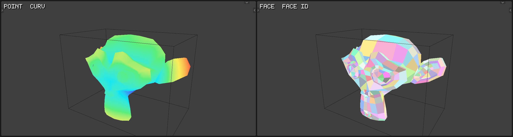

*One object, two domains. `curv` on Point is a smooth gradient; `face_id` on
Face is flat per facet.*

### Colour — how a value becomes a colour

Colour follows the **data type**; it isn't a free choice:

- **Heat** — a scalar through a ramp. By default **Auto Range normalises across
  everything the visualizer watches**, not per object, so several objects share
  one scale and can be compared. Turn Auto Range off to set Min/Max yourself.
- **RGB** — a vector's channels mapped straight to colour.
- **Random** — a stable colour per id, for ints and categorical data.

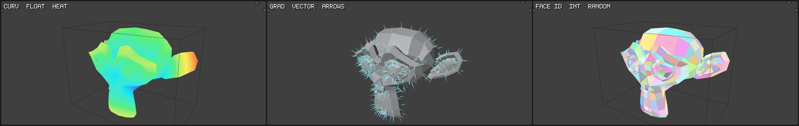

*`curv` (float) as Heat, `grad` (vector) as RGB, `face_id` (int) as Random.*

### Type — how it's drawn

Type changes *how* a value is drawn, not *which* value is read. Type and Colour
are independent.

- **Markers** — a point per element. Where things are, and how many.
- **Surface** — false colour across the mesh. The gradient over a whole form.
- **Arrows** — cones along a vector. Direction and relative magnitude.
  **Needs a vector.**
- **Tags** — the value printed as text at the element, for reading an actual
  number off one. Capped, so it stays legible.

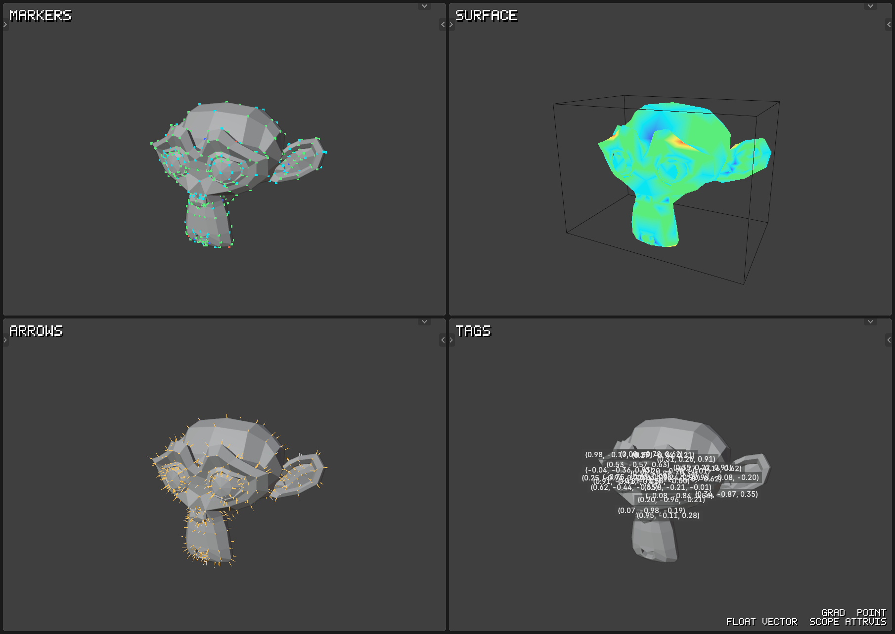

*The same `grad`, as RGB throughout, drawn each of the four ways.*

### It won't touch your render or your file

Visualizers are ordinary objects in a `Visualizers` collection. They save with
your `.blend`, and they don't appear in an F12 render.

---

## One visualizer, many objects

Point a visualizer at a **collection** rather than an object and every member
draws the same attribute, the same way, on the same scale. That's what Scope is
for: scan a scattered set for the one that's wrong instead of clicking through
them one at a time.

`attrvis` is just the default collection name — rename it, or make your own
from a selection.

Objects in the scope that don't carry the attribute simply don't get ink. They
stay visible, plainly undecorated, and the panel reports the count. That
mismatch is usually the interesting part — those are the objects where your
tree didn't run.

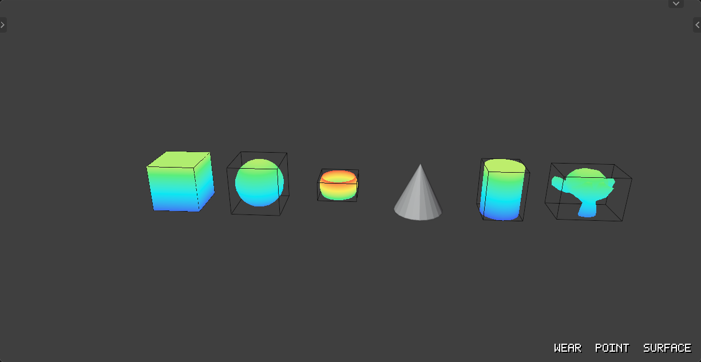

*One visualizer over six objects. The fourth is plainly hot; the sixth is grey
because it never got the attribute.*

---

## Three things you can now do

### Fix a node tree you can't see into

Your scatter density is driven by an attribute that's wrong somewhere.
Visualize it on Face and the dead patch is obvious in the viewport — no probing
single rows in the Spreadsheet.

### Check a field before you drive something with it

Look at `grad` as Arrows, confirm the directions are what you meant, *then*
wire it into instance rotation. That confirmation step doesn't exist in Blender
today; you wire it up and infer backwards from the result.

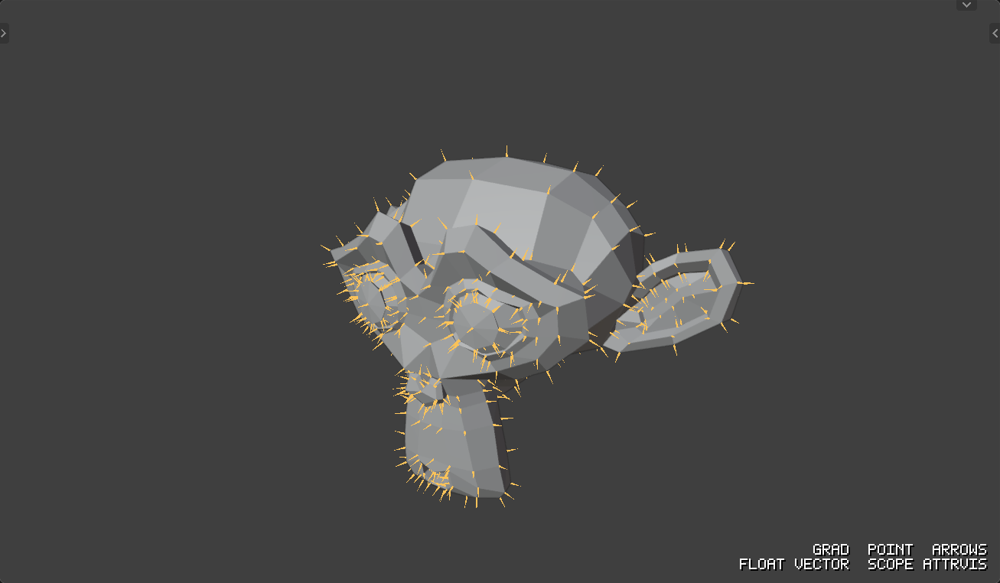

*`grad · Point · Arrows`. Arrows are additive — they sit on the geometry. Only
Surface replaces it.*

### Read data you didn't author

A USD or Alembic import lands with attributes you didn't write. There's no tree
to inspect and nothing to have anticipated. Point a visualizer at it and look.

---

## The UI in detail

### The right-click menu

Domain-first. Each submenu shows only what exists on that domain, with its type
and the Colour / Type pair it will create.

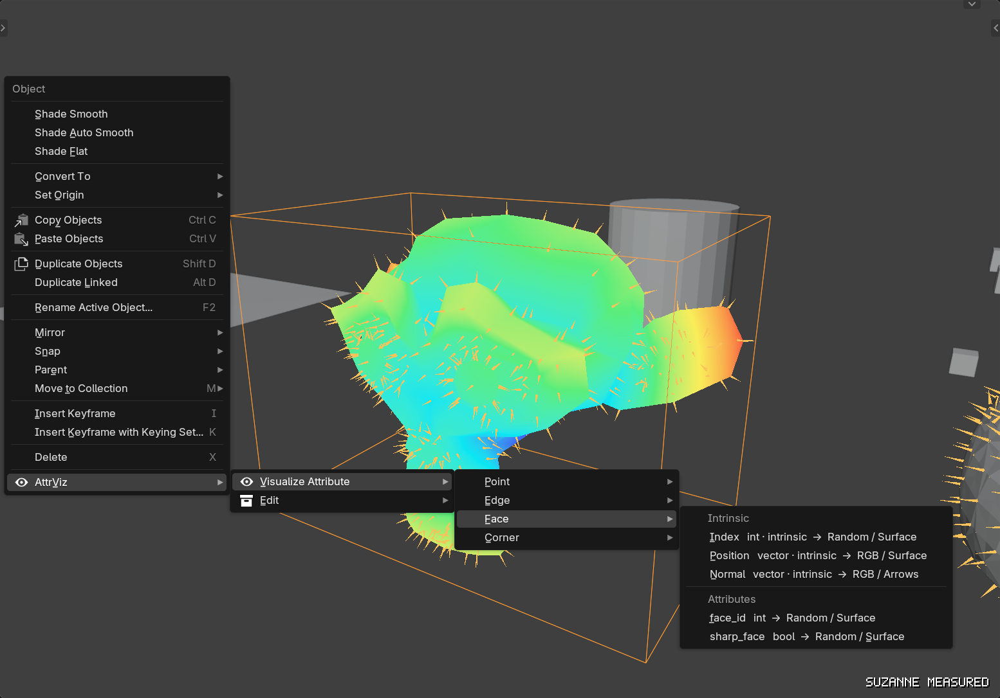

*Face carries `face_id` and `sharp_face`; Point does not.*

### The Viz panel

Visualizers group under the collection each one watches.

- The **group checkbox** ANDs with each visualizer's own toggle, so individual
  states survive a group being switched off and back on.
- **Clicking a group name** makes that collection active — the destination for
  Add / Remove, and the default scope for the next visualizer.
- **One visualizer is expanded at a time.** Opening one closes the others, so
  compare by switching rather than by expanding both.

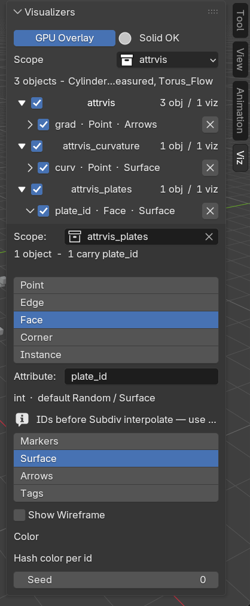

*Several scopes, live `obj / viz` counts, and one visualizer expanded.*

### Adding and removing objects

Adding is **additive**: an object stays in every collection it already belongs
to. Scopes are flat unless you nest them yourself in the outliner.

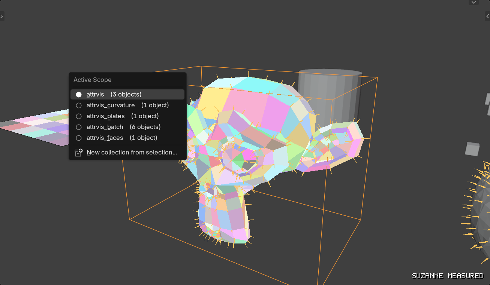

*Every collection with its live count, and a filled radio on the active one.*

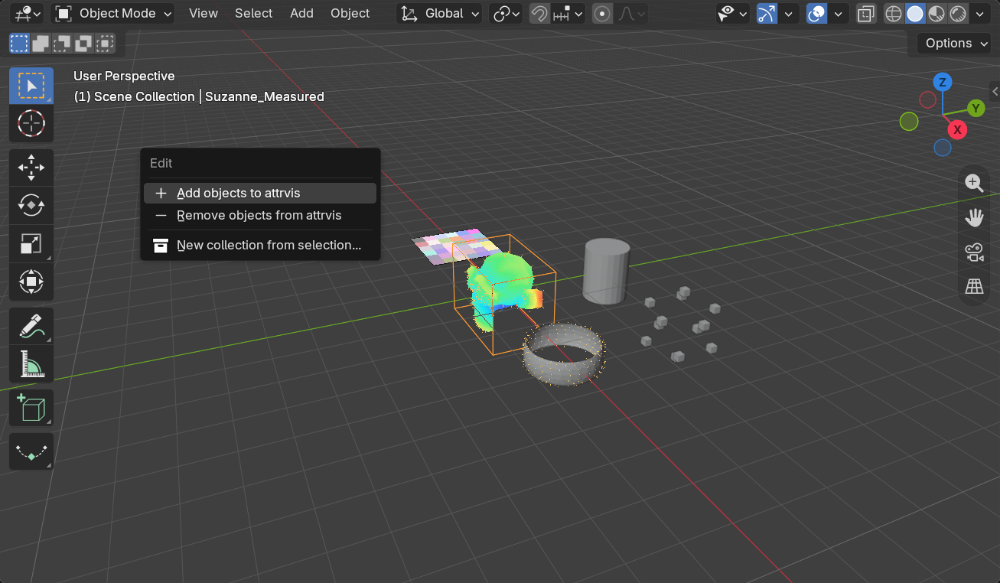

*The labels name the destination, because with several scopes "Add objects"
alone doesn't say where.*

---

## When you turn it on and see nothing

In the order worth checking:

1. **Wrong domain** — the value is on Face and you're looking at Point.
2. **The object doesn't carry it** — check the coverage count in the panel.
3. **GPU Overlay is off** and you're in Solid shading. It's on by default and
   draws unlit ink in Solid; turn it off only for the materials path, where
   Material Preview is preferred.
4. **The geometry is instanced** — the menu says so in place.

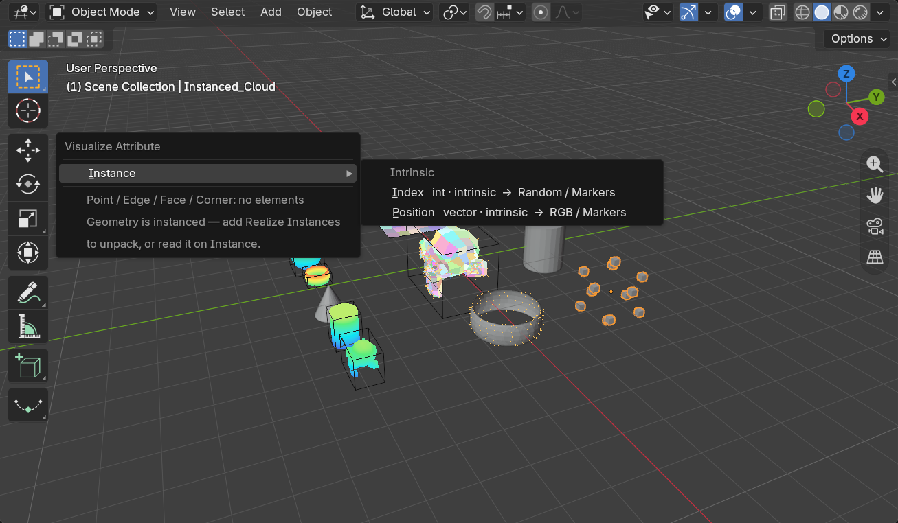

*Mesh domains empty, Instance populated: read it on Instance, or add Realize
Instances to unpack.*

---

## Limits

- **Tags is capped** and needs a low cap to stay readable on dense meshes.
- **Auto Range shows no numbers.** With it on, the computed min and max aren't
  displayed anywhere — you can see the shape of a field but not read its
  bounds.
- Sampling cost grows with element count; heavy meshes are slower to refresh.

---

## Install

Grab a release zip (or build one, below), then:
**Edit → Preferences → Get Extensions → ⌄ → Install from Disk…**

Build from source:

```
blender --command extension build --source-dir attrviz --output-dir build
blender --command extension install-file --repo user_default --enable build/attrviz-<version>.zip
```

Developed against **Blender 5.0+** (tested on 5.0.1 and 5.2.0). Current addon
version: **0.5.12**.

## Why it's fast (and safe)

A visualizer never mutates the object it watches. It *watches* it via Object
Info / Collection Info through the depsgraph.

**GPU Overlay (default):** sample evaluated attributes → upload GPU batches →
`POST_VIEW` draw. Works in **Solid** shading; F12 beauty stays clean
(`hide_render` on viz carriers).

**Materials fallback:** with GPU Overlay off, the visualizer's own Geometry
Nodes modifier generates marker / surface / arrow carriers and an emission
material reads `vizcol`. Prefer **Material Preview** for that path.

## Tests

All suites run headless. The GPU overlay itself is not headless-testable — the
draw handler needs a real viewport — so the draw *logic* is factored to take
its callables as arguments and tested without one.

```
blender --background --factory-startup --python-exit-code 1 \
  --python tests/<suite>.py
```

| Suite | Covers |
| --- | --- |
| `headless_test.py` | main suite — GN path + registry |
| `test_gpu_sample.py` | GPU sampler, Surface / Arrows geometry, attribute reads |
| `test_watch_collection.py` | scopes, active scope, group enable, mute scope, coverage |
| `test_overlay_kinds.py` | texture packing, view cull, occlusion filter |
| `test_gpu_color.py` | colour mappers, empty-sample handling |
| `test_draw_guard.py` | per-visualizer failure containment in the draw loop |
| `test_surface_direct.py` | direct Surface construction |

Every screenshot in this README is generated from
[`examples/attrviz_docs.blend`](examples/) and checked for drift; see
[`dev_tasks/015_docs_capture/`](dev_tasks/015_docs_capture/).

## Design notes

Houdini users: this is the Blender equivalent of attribute visualizers, with
scopes standing in for groups.

[`docs/explorations.md`](docs/explorations.md) — design work that is settled
enough to remember but not scheduled: the constant/varying readout, Tags
collapse, and pointers to what is parked in the PORs.

## Roadmap

- Tags: dynamic glyph atlas (semantic text at higher caps), then compiled
  overlay if needed
- HUD overlay for non-geometry data (custom properties, transforms)
- VDB / volume grid visualization
- Stronger Edge surface / wire display

## License

GPL-3.0-or-later. See [LICENSE](LICENSE).
