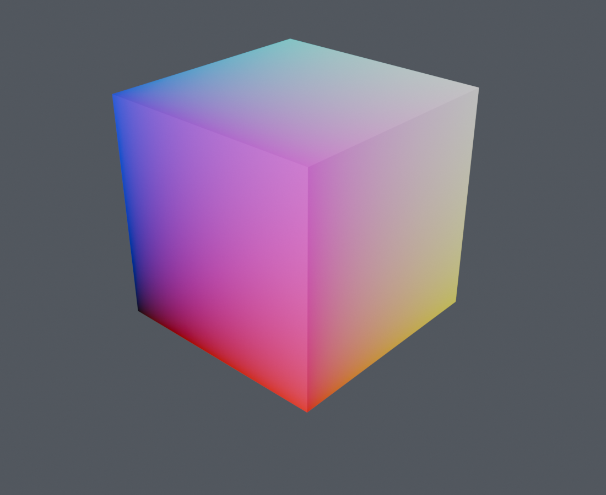

# blender_attrviz

Houdini-style attribute visualizers for Blender — first-class, native,
and zero-mutation. Right-click any object, pick an attribute, see it.



*The default cube, `position`, one click: RMB → Visualize Attribute →
position. Vector attributes auto-map to RGB on the surface.*

## What it is

Blender has no equivalent of Houdini's visualizers — the geometry
spreadsheet shows numbers, the Viewer node is transient, and nothing
gives you persistent, per-object "show me this attribute in the
viewport" workflow. AttrViz adds it:

- **Visualizers are ordinary scene objects** in a visible
  `Visualizers` collection. The outliner is the registry; the
  viewport **eye icon** / **Enabled** toggles each one; delete the
  object, the visualizer is gone. They save with your .blend.
- **RMB → Visualize Attribute** lists every attribute on the object's
  *evaluated* geometry (so attributes created by Geometry Nodes
  modifiers show up too) and creates a visualizer with sensible
  defaults in one click.
- **A "Viz" tab in the 3D viewport sidebar** lists all visualizers:
  toggle, remove, and tune Domain / Attribute / Type / Color plus
  per-type controls (scale, density, arrow length, tag cap, …).
- **GPU Overlay (default on)** draws Markers, Surface, and Arrows as
  unlit Solid-mode ink — no Material Preview required. Turn it off in
  the Viz panel to fall back to the Geometry Nodes + emission material
  path.

## Why it's fast (and safe)

A visualizer never mutates the object it watches. It *watches* it via
Object Info / Collection Info through the depsgraph.

**GPU Overlay (default):** sample evaluated attributes → upload GPU
batches → `POST_VIEW` draw (points, false-color mesh, 4-sided cones).
Works in **Solid** shading; F12 beauty stays clean (`hide_render` on
viz carriers).

**Materials fallback:** when GPU Overlay is off, the visualizer's own
Geometry Nodes modifier generates marker / surface / arrow carriers
and an emission material reads `vizcol`. Prefer **Material Preview**
for that path.

Tags stay on a capped BLF text path (semantic strings OK); see Roadmap
for atlas work.

## Visualization axes

| Axis | Options | Notes |
| --- | --- | --- |
| **Domain** | `Point` \| `Edge` \| `Face` \| `Corner` | Localizes the read — Houdini-style. Face attrs draw on faces, not smeared to points. |
| **Color** | `Heat` \| `RGB` \| `Random` | Heat = scalar through a ramp. RGB = vector channels. Random = stable hash color per element id (ints / categorical). |
| **Type** | `Markers` \| `Surface` \| `Arrows` \| `Tags` | **GPU Overlay:** Markers = points, Surface = false-color mesh, Arrows = 4-sided cones. **Tags** = BLF labels (Tag Cap = max count; Size = int px). |

**RMB → Visualize Attribute** opens **domain submenus**, then attributes
on that domain. Auto-pick is domain-aware (e.g. Face + int → Random +
Surface). Overridable in the Viz panel; each visualizer owns its engine
copy. Use **Enabled** to show one at a time — no compositing.

Intrinsics **Index**, **Position**, and **Normal** are always available
(GN fields / evaluated topology — not frozen authored ids).

Scope: a visualizer can watch a single object, or a whole collection
through its `Scope` socket — one visualizer covering many objects.

## Install

Grab a release zip (or build one, below), then:
**Edit → Preferences → Get Extensions → ⌄ → Install from Disk…**

Build from source:

```
blender --command extension build --source-dir attrviz --output-dir build
blender --command extension install-file --repo user_default --enable build/attrviz-<version>.zip
```

Developed against **Blender 5.0+** (tested on 5.0.1 and 5.2.0). Current
addon version: **0.5.12**.

## Tests

```
# Main suite (GN path + registry)
blender --background --factory-startup --python-exit-code 1 \
  --python tests/headless_test.py

# GPU sampler / Surface / Arrows geometry (no draw in background)
blender --background --factory-startup --python-exit-code 1 \
  --python tests/test_gpu_sample.py
```

## Roadmap

- Tags: dynamic glyph atlas (semantic text at higher caps), then
  compiled overlay if needed
- HUD overlay for non-geometry data (custom properties, transforms)
- VDB / volume grid visualization
- Stronger Edge surface / wire display

## License

GPL-3.0-or-later. See [LICENSE](LICENSE).
